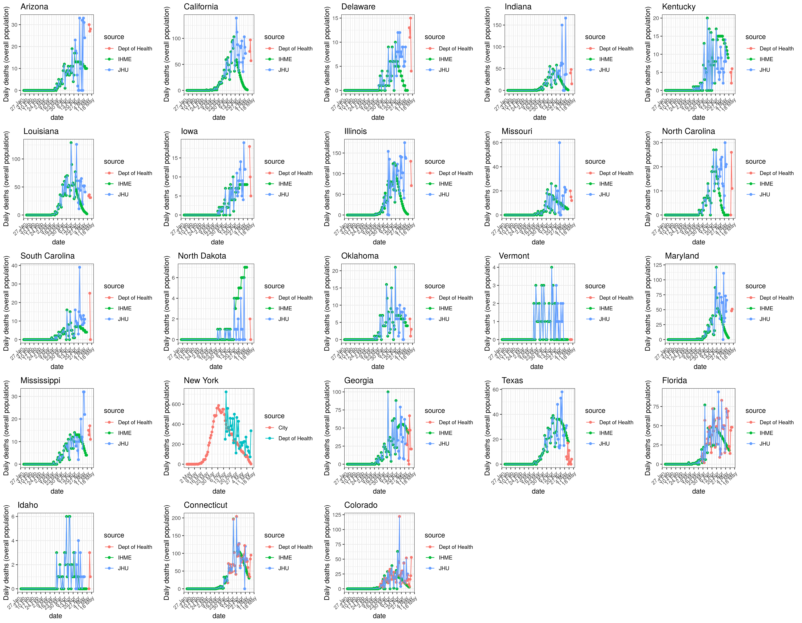

# US-covid19-data-scraping
Extract and data from various states in the US related to COVID-19. We need the Python dependencies
```
fitz
PyMuPDF
pandas
pyjson
beautifulsoup4
requests
selenium
```

1. To extract and clean, run
```
make files
```
This will get you the latest data in `data/$DATE` and `pdfs/$DATE`.

2. To process, run
```
Rscript scripts/process.data.R
```
This will get you csv files for every state with variables *age*, *date*, *daily.deaths* or *weekly.deaths* and *code* in `data/$DATE/processed`.

3. To create the figures, run
```
Rscript scripts/plot.comparison.and.timeseries.R
```
This will get you pngs in `figures/` of 
* Comparison between extracted data from the Department of Health and IHME and JHU overall deaths as well as,
* Time series of overall deaths for every state.


## PDF extractions
We use Requests to make HTTP/HTTPS requests to a web API, BeautifulSoup to extract the download links in the HTML page and Fitz to extract the data within the PDF. The resulting data is stored in a `.json` file in `data/$DATE`.

## non-PDF extractions (e.g. csvs, xlsx ...)

We use Requests to make HTTP/HTTPS requests to a web API, checking whether the data is up-to-date. We then download the raw files to `data/$date`, via `scripts/age_extraction.py`. This is summarised in `Makefile` in the `make files` directive.

## Dynamic websites

We use webdriver from selenium to find the elements and extract the corresponding data. 

## State specifications
| Country        | Date record start           | Notes and link  |
| ------------- |:-------------:| -----:|
| Florida| 2020-03-26 |[link](https://www.floridadisaster.org/covid19/covid-19-data-reports/); file string; age data on page 3 table: `covid-19-data---daily-report-$year-$month-$day-$time.pdf` |
| Connecticut| 2020-04-05 | [link](https://data.ct.gov/api/views/ypz6-8qyf/rows.csv); full time series|
| Colorado| 2020-03-23 | [link](https://data-cdphe.opendata.arcgis.com/datasets/cdphe-covid19-state-level-open-data-repository?geometry=-125.744%2C35.977%2C-85.358%2C41.950); full time series|
| Massachusetts| 2020-04-20 | [link](https://www.mass.gov/doc/covid-19-dashboard-april-20-2020/download); similar to florida |
| New Jersey| 2020-05-06 | [link](https://www.nj.gov/health/cd/documents/topics/NCOV/COVID_Confirmed_Case_Summary.pdf); cumulative, need extracting daily |
| New York City| 2020-04-14 | [link](https://www1.nyc.gov/assets/doh/downloads/pdf/imm/covid-19-deaths-confirmed-probable-daily-04142020.pdf); daily cumulative, need extracting daily|
| Georgia| 2020-04-27 | [link](https://ga-covid19.ondemand.sas.com/docs/ga_covid_data.zip); daily cumulative, need extracting daily; no historical archive; missing data between 2020-04-27 and 2020-05-06|
| Washington| 2020-05-04 | [link](https://www.doh.wa.gov/Portals/1/Documents/1600/coronavirus/data-tables/PUBLIC-CDC-Event-Date-SARS.xlsx); daily cumulative, need extracting daily; no historical archive|
| CDC| 2020-05-06 | [link](https://data.cdc.gov/api/views/9bhg-hcku/rows.csv); daily cumulative, need extracting daily; no historical archive|
| Texas| 2020-05-06 | [link](https://dshs.texas.gov/coronavirus/TexasCOVID19CaseCountData.xlsx); daily cumulative, need extracting daily; no historical archive|
| Louisiana| 2020-05-12| [link](http://ldh.la.gov/coronavirus/); daily updated and replaced, need extracting daily; no historical archive|
| Oklahoma| 2020-05-13| [link](https://looker-dashboards.ok.gov/embed/dashboards/42); daily updated and replaced, need extracting daily; no historical archive. Website changed from 06-06, pdf: [link](https://coronavirus.health.ok.gov/executive-order-reports); file string, age deaths on page 2|
| North Carolina| 2020-05-13| [link](https://covid19.ncdhhs.gov/dashboard#by-age); daily updated and replaced, need extracting daily; no historical archive|
| Mississippi| 2020-05-12| [link](https://msdh.ms.gov/msdhsite/_static/14,0,420.html); daily updated and replaced, need exreacting daily; no historical archive|
| Missouri| 2020-05-13| [link](https://health.mo.gov/living/healthcondiseases/communicable/novel-coronavirus/results.php);  daily updated and replaced, need exreacting daily; no historical archive|
| Delaware| 2020-05-12| [link](https://myhealthycommunity.dhss.delaware.gov/locations/state); daily updated and replaced, need exreacting daily; no historical archive|
| Vermont| 2020-05-13| [link](https://vcgi.maps.arcgis.com/apps/opsdashboard/index.html#/6128a0bc9ae14e98a686b635001ef7a7); daily updated and replaced, need exreacting daily; no historical archive| 
| Arizona| 2020-05-13| [link](https://www.azdhs.gov/preparedness/epidemiology-disease-control/infectious-disease-epidemiology/covid-19/dashboards/index.php); daily updated and replaced, need exreacting daily; no historical archive| 
| North Dakota| 2020-05-14| [link](https://www.health.nd.gov/diseases-conditions/coronavirus/north-dakota-coronavirus-cases); daily updated and replaced, need exreacting daily; no historical archive| 
| Kentucky| 2020-05-13| [link](https://kygeonet.maps.arcgis.com/apps/opsdashboard/index.html#/543ac64bc40445918cf8bc34dc40e334); daily updated and replaced, need exreacting daily; no historical archive| 
| California| 2020-05-13| [link](https://public.tableau.com/views/COVID-19PublicDashboard/Covid-19Public?%3Aembed=y&%3Adisplay_count=no&%3AshowVizHome=no) and [link](https://www.cdph.ca.gov/Programs/CID/DCDC/Pages/COVID-19/Race-Ethnicity.aspx#) (from 2020-05-25); daily updated and replaced, need exreacting daily; no historical archive| 
| Indiana| 2020-05-13| [link](https://www.coronavirus.in.gov/) and [link](https://hub.mph.in.gov/dataset?q=COVID); daily updated and replaced, need exreacting daily; no historical archive| 
| Maryland| 2020-05-14| [link](https://coronavirus.maryland.gov/); daily updated and replaced, need exreacting daily; no historical archive| 
| Alabama| 2020-04-08| [link](https://www.alabamapublichealth.gov/covid19/); daily report, missing data for 2020-04-20,2020-04-24, 2020-04-26, 2020-04-27, from 2020-04-29 to 2020-05-02 and 2020-05-10|
| Idaho| 2020-05-13| [link](https://public.tableau.com/profile/idaho.division.of.public.health#!/vizhome/DPHIdahoCOVID-19Dashboard_V2/Story1); daily updated and replaced, need exreacting daily; no historical archive| 
| Kansas| 2020-05-13| [link](https://www.coronavirus.kdheks.gov/160/COVID-19-in-Kansas); updated every monday, wednesday and friday; no historical archive| 
| South Carolina| 2020-05-13| [link](https://www.scdhec.gov/infectious-diseases/viruses/coronavirus-disease-2019-covid-19/sc-demographic-data-covid-19); updated every tuesday and friday; no historical archive| 
|Iowa| 2020-05-13| [link](https://coronavirus.iowa.gov/pages/case-counts); daily updated and replaced, need extraction daily; no historical archive| 
|Illinois| 2020-05-14 | [link](https://www.dph.illinois.gov/covid19/covid19-statistics); daily updated and replaced, need extraction daily; no historical archive| 
|Nevada| 2020-06-07 | [link](https://nvhealthresponse.nv.gov); daily updated and replaced, need extraction daily; no historical archive| 
|Oregon| 2020-06-05 | [link](https://govstatus.egov.com/OR-OHA-COVID-19); updated and replaced on weekdays, need extraction daily; no historical archive|
|Pennsylvania| 2020-06-07 | [link](https://experience.arcgis.com/experience/cfb3803eb93d42f7ab1c2cfccca78bf7); daily updated and replaced, need extraction daily; no historical archive|


## Warnings
### Updates
- Florida did not publish a report on 2020-05-09
- South Carolina data have not been updated on 2020-05-17
- Iowa did not update the website on 2020-05-18
- Idaho did not update the website on 2020-05-18
- Missouri change website on the 2020-05-20 and did not update
- Indiana did not update the data on 2020-05-30

### Website dynamics
- For Washington, the download URL keeps changing between using `-` and `_` separators. When there's an error, simply use the recommended line of code in `get_washington()`
- For Missouri, the website is changed on 2020-05-21, cannot find the timestamp
- Delware did not update the website on 2020-05-21
- For Oklahoma, website changed on 2020-06-06

### About the data
- For North Carolina, the total death number is updated daily, but the age death data is not updated daily. The website format changes from 2020-05-20 
- NY and NJ have a 1 day latency, meaning that the cumulative deaths we extract on day t are the cumulative deaths in day t-1
- From 2020-06-04, age band 0-9 was added for Kentucky 


## Figures
### Time series of extracted data as of 2020-05-16


### Comparison to IHME and JHU overall death as of 2020-05-16

