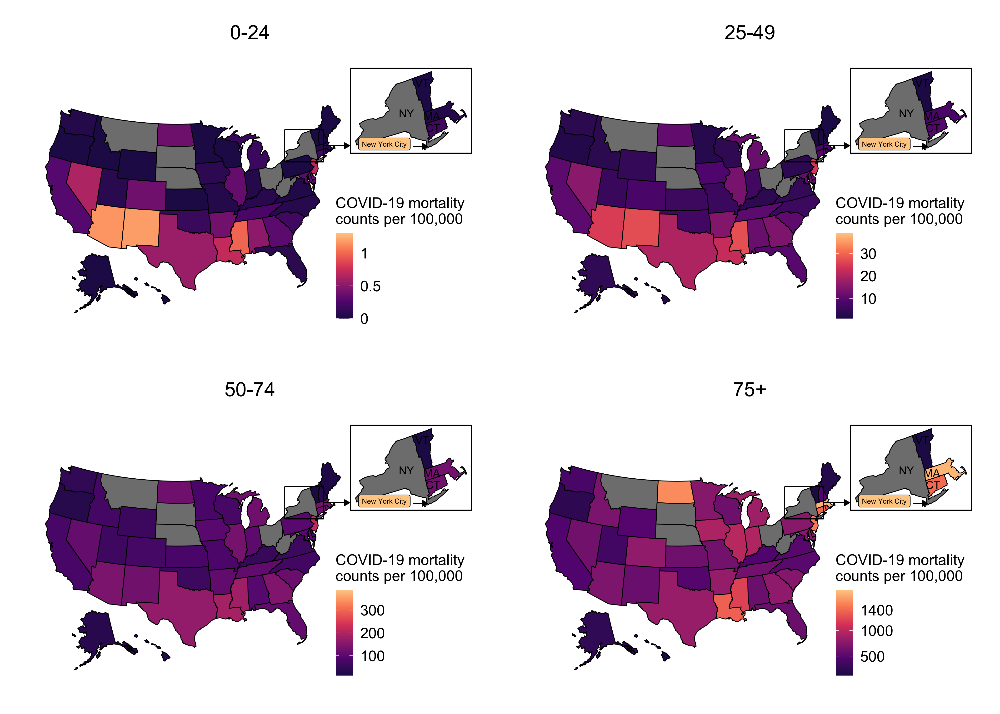

# Visualization of age-specific COVID-19 mortality data in the United-States

## Overview
Death counts from different age stratifications were used to estimate death counts and crude case counts in common age bands across all locations using a latent Dirichlet-multinomial model.

The model and associated estimations have been used in our upcoming [peer-reviewed age paper](https://www.medrxiv.org/content/10.1101/2020.09.18.20197376v1), where we use age-specific mobility data to estimate the epidemic in the USA by accounting for age-specific heterogeneity.

## Data
One may directly find the crude estimates of the COVID-19 cases and mortality across common age strata [here](https://github.com/ImperialCollegeLondon/US-covid19-agespecific-mortality-data/blob/master/data_visualization/tables_v120/df_predict_reporting_age_strata_201126_cured.rds). Please note that the data were reproduced in [this repositoy](https://github.com/ImperialCollegeLondon/covid19model/tree/master/covid19AgeModel).

## Usage
### Dependencies
- R version >= 4.0.2
- R libraries:
```
rstan
data.table
ggplot2 
scales
gridExtra
tidyverse
reshape2
```

### Generate estimations 
First, to generate the posterior samples run,
```bash
$ cd data_visualization/
$ Rscript scripts_v120/predict_deaths_common_age_run_stan.R
```
Second, produce the convergence diagnostics and summary tables of the posterior samples with,
```bash
$ Rscript scripts_v120/predict_deaths_common_age_make_table.R
$ Rscript scripts_v120/predict_deaths_common_age_make_figure.R
```
Finally, produce the postprocessing figures and tables with,
```bash
$ Rscript scripts_v120/make_summary_predict_deaths_ntl_age_strata.r
$ Rscript scripts_v120/make_summary_predict_deaths_reporting_age_strata.r
$ Rscript scripts_v120/make_summary_predict_deaths_state_age_strata.r
```
The figures are stored under 
```bash
figures/
```
and the tables under
```bash
tables/
```

## Results
### Mortality Rate By Age


### Mortality Rate By Age - USA map


### Proportion of individuals aged 20-49 among COVID-19 cases 


### Proportion of COVID-19 attributable deaths By Age


