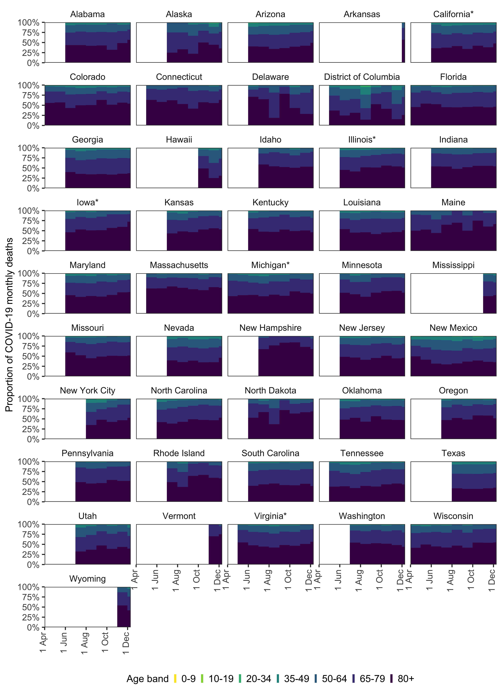

# Visualization of age-specific COVID-19 mortality data in the United-States

## Overview
The data from different age stratifications were used to estimate death counts in the common age bands across all locations using a latent Dirichlet-multinomial model.

The model and associated estimations have been used in:

- M Monod, A Blenkinsop, X Xi et al. [Report 32: Age groups that sustain resurging COVID-19 epidemics in the United States Imperial College London](https://www.imperial.ac.uk/mrc-global-infectious-disease-analysis/covid-19/covid-19-reports/) (version 2, 07-01-2021), doi: https://doi.org/10.25561/82551.


## Usage
### Dependencies
- R version >= 4.0.2
- R libraries:
```
rstan
data.table
ggplot2 
scales
gridExtra
tidyverse
reshape2
```

### Reproduce estimations used in the final version for publication (package version 1.2.0) of https://github.com/ImperialCollegeLondon/covid19model/covid19AgeModel
First, generate the estimations posterior samples run,
```bash
$ cd data_visualization/
$ Rscript scripts_v120/predict_deaths_common_age_run_stan.R
```
Second, produce the convergence diagnostics and summary tables of the posterior samples with,
```bash
$ Rscript scripts_v120/predict_deaths_common_age_make_table.R
$ Rscript scripts_v120/predict_deaths_common_age_make_figure.R
```
Finally, produce the postprocessing figures and tables with,
```bash
$ Rscript scripts_v120/make_summary_predict_deaths_ntl_age_strata.r
$ Rscript scripts_v120/make_summary_predict_deaths_reporting_age_strata.r
$ Rscript scripts_v120/make_summary_predict_deaths_state_age_strata.r
```
The figures are stored under 
```bash
figures/
```
and the tables under
```bash
tables/
```

## Results
### Mortality Rate By Age


### Mortality Rate By Age - USA map


### Proportion of individuals aged 20-49 among COVID-19 cases 


### Proportion of COVID-19 attributable deaths By Age


